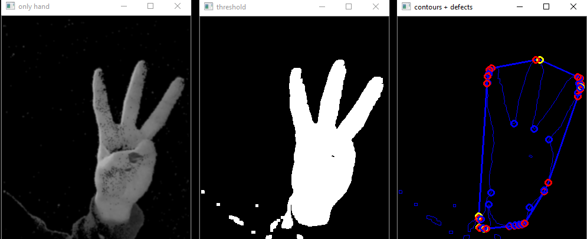

## Handraw

This was the final project for a computer vision course at Ecole Polytechnique, taught by [Renaud Keriven](http://imagine.enpc.fr/~keriven/). It is a sketching program powered by hand tracking and gesture recognition. The hand is outlined thanks to a background subtraction algorithm and the gesture is determined by studying its convexity defects, as shown in the following figure.

